# 🚌 BusHub — Dhaka Bus Route & Fare Finder

<div align="center">

### 🚍 *Smart Public Transportation Solution for Dhaka City*

**Find the Right Bus • Know the Exact Fare • View Complete Routes**

[](https://flutter.dev)
[](https://dart.dev)
[](https://firebase.google.com)
[](https://www.openstreetmap.org)
[](https://flutter.dev)
[](LICENSE)


</div>

---

# 🚀 Hero Banner

> ### 📍 **Navigate Dhaka with Confidence**
>
> **BusHub** is a modern Flutter application that helps commuters search bus routes, calculate fares, visualize complete journeys on interactive maps, and manage transportation data through a secure Firebase-powered administration panel.
>
> Designed as a **Final Year University Project**, BusHub demonstrates modern mobile application development using **Flutter, Firebase, OpenStreetMap, OSRM, and Nominatim APIs**.

---

# 📑 Table of Contents

- [📖 Overview](#-overview)
- [✨ Features](#-features)
- [📱 Screenshots](#-screenshots)
- [🛠 Technology Stack](#-technology-stack)
- [🏗 System Architecture](#-system-architecture)
- [📂 Project Structure](#-project-structure)
- [⚙ Installation](#-installation)
- [🔥 Firebase Setup](#-firebase-setup)
- [▶ Running the Application](#-running-the-application)
- [🔐 Admin Credentials](#-admin-credentials)
- [🗄 Database Schema](#-database-schema)
- [📡 API Documentation](#-api-documentation)
- [🗺 Roadmap](#-roadmap)
- [📊 Project Statistics](#-project-statistics)
- [📝 Changelog](#-changelog)
- [📄 License](#-license)
- [📬 Contact](#-contact)

---

# 📖 Overview

## 🎯 About the Project

**BusHub – Dhaka Bus Route & Fare Finder** is a cross-platform mobile application developed using **Flutter** that provides commuters with reliable and accurate bus information throughout **Dhaka City**.

The application bridges the gap between commuters and public transportation by offering a centralized platform where users can search buses, view complete routes, calculate fares, and visualize journeys on interactive maps.

Unlike traditional information sources, BusHub combines **Cloud Firestore**, **Firebase Authentication**, **OpenStreetMap**, and **OSRM Routing** into one complete solution.

---

## ❗ Problem Statement

Every day, thousands of commuters in Dhaka struggle because there is no reliable and centralized source for bus route information.

Common challenges include:

- ❌ No unified database for bus routes
- ❌ Uncertain fare information
- ❌ Difficulty finding buses between locations
- ❌ Lack of complete stop-by-stop route information
- ❌ Difficult for tourists and newcomers
- ❌ Heavy dependence on word-of-mouth information

---

## 💡 Our Solution

BusHub provides a complete digital solution by offering:

- 🚌 Bus search using Source & Destination
- 💰 Automatic fare calculation
- 🗺 Interactive OpenStreetMap integration
- 📍 Route visualization with stop markers
- 📋 Complete station list
- 🔄 Real-time Firebase synchronization
- 🔐 Secure Admin Panel
- 📱 Cross-platform mobile support

---

# ✨ Features

## 👤 User Features

| Feature | Description |
|---------|-------------|
| 🔍 **Smart Bus Search** | Search buses between any two locations using dropdown menus |
| 🚌 **Complete Bus Routes** | View the complete journey including every bus stop |
| 💰 **Fare Calculator** | Automatically calculate fares between selected stations |
| 📊 **Fare Breakdown** | View fare for every intermediate station |
| 🗺 **Interactive Maps** | Visualize routes on OpenStreetMap |
| 📍 **GPS Location** | Instantly locate your current position |
| 🚏 **Bus Details** | Browse all available buses and their routes |
| ⚡ **Real-Time Updates** | Fetch latest information from Firebase |
| 🎨 **Modern UI** | Clean Material Design 3 user interface |
| 📱 **Cross Platform** | Supports both Android and iOS |

---

## 🔐 Admin Features

| Feature | Description |
|---------|-------------|
| 🔒 **Secure Authentication** | Login using Firebase Authentication |
| ➕ **Add Bus** | Create new buses with routes and fares |
| ✏ **Edit Bus** | Update route information anytime |
| 🗑 **Delete Bus** | Remove outdated buses from database |
| 🗺 **Route Picker** | Select exact stop coordinates using maps |
| 📍 **Location Management** | Automatically maintain location database |
| 💾 **Sample Data Loader** | Initialize Firestore with sample routes |
| 📊 **Dashboard** | Manage buses from a centralized admin panel |
| 🔄 **Real-Time Database** | Instantly sync changes with Firestore |

---

## ⭐ Why BusHub?

✔ Beginner-friendly interface

✔ Accurate fare calculation

✔ Complete route visualization

✔ Interactive OpenStreetMap

✔ Firebase cloud backend

✔ Secure authentication

✔ Cross-platform support

✔ Clean project architecture

✔ Easy to maintain

✔ Scalable for future enhancements

---

<div align="center">

## 🌟 *Making Public Transportation Smarter for Everyone.*

</div>

---

# 📱 Screenshots


## 🏠 Home Screen

<p align="center">
  <a href="assets/screenshots/home_screen.png">
    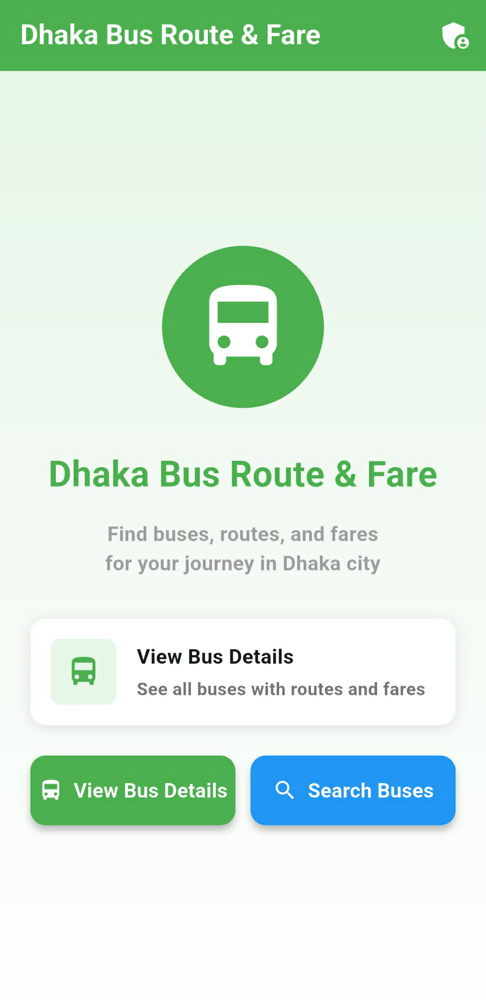
  </a>
</p>

---

## 🔍 Search Screen

<p align="center">
  <a href="assets/screenshots/search_screen.png">
    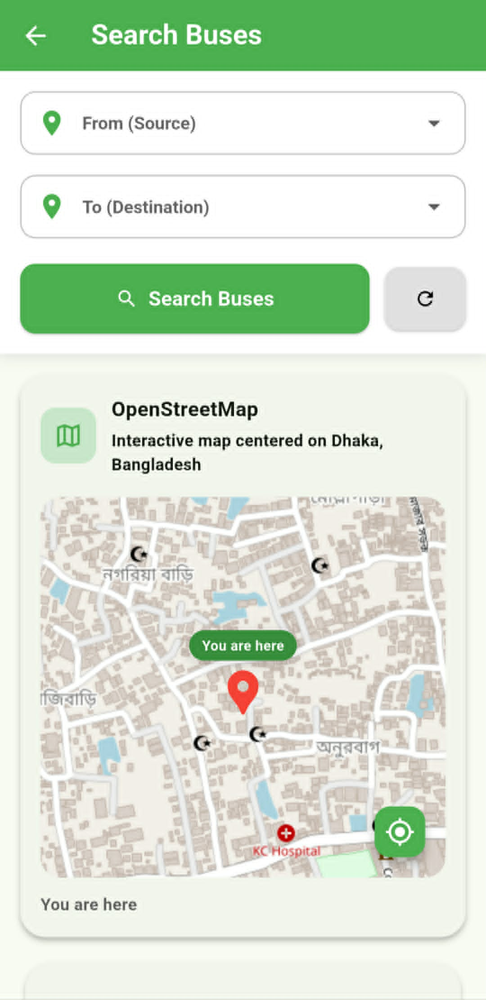
  </a>

  <a href="assets/screenshots/search_screen_1.png">
    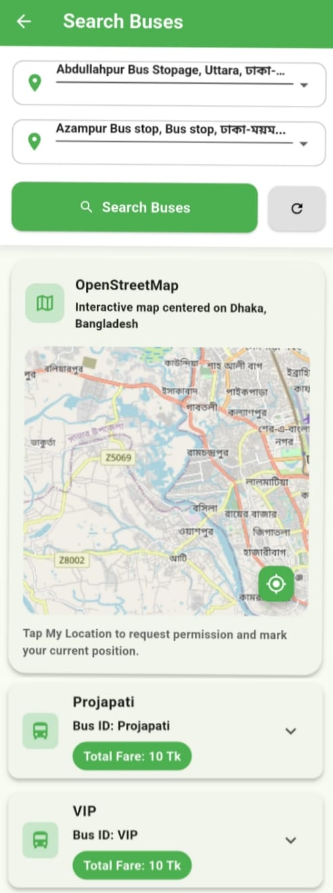
  </a>

  <a href="assets/screenshots/search_screen_2.png">
    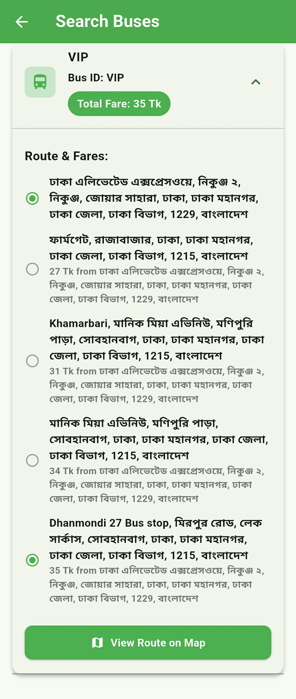
  </a>
</p>

---

## 🗺️ Route Map

<p align="center">
  <a href="assets/screenshots/map_view.png">
    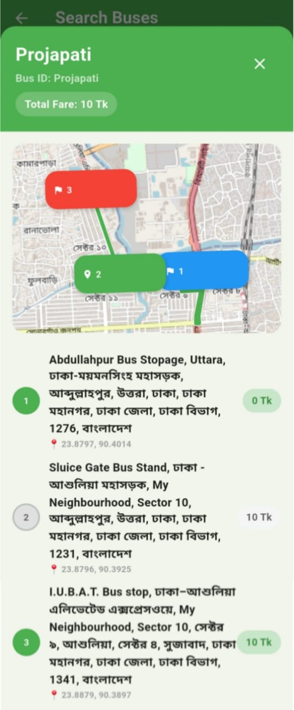
  </a>
</p>

---

## 🚌 Bus Details

<p align="center">
  <a href="assets/screenshots/bus_list.png">
    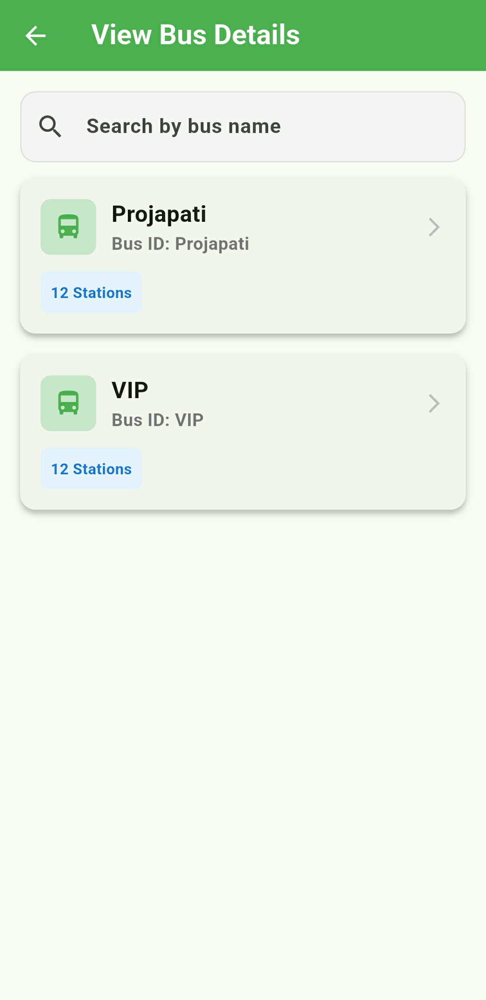
  </a>

  <a href="assets/screenshots/bus_list_1.png">
    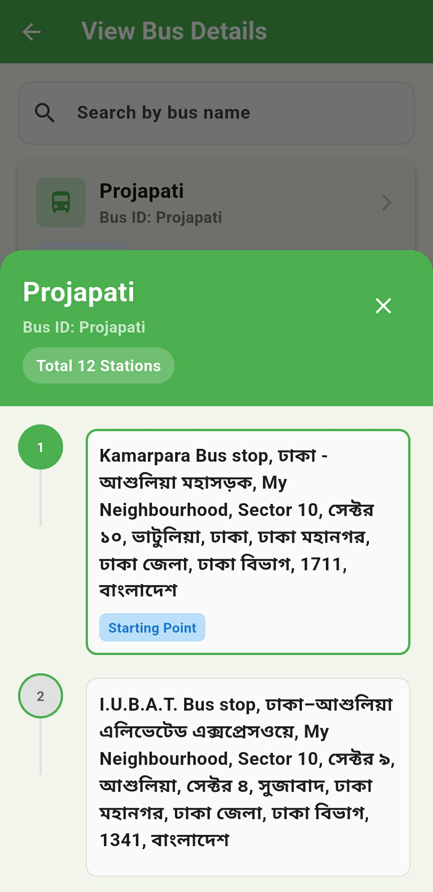
  </a>
</p>

---

## 🔐 Admin Login

<p align="center">
  <a href="assets/screenshots/admin_login.png">
    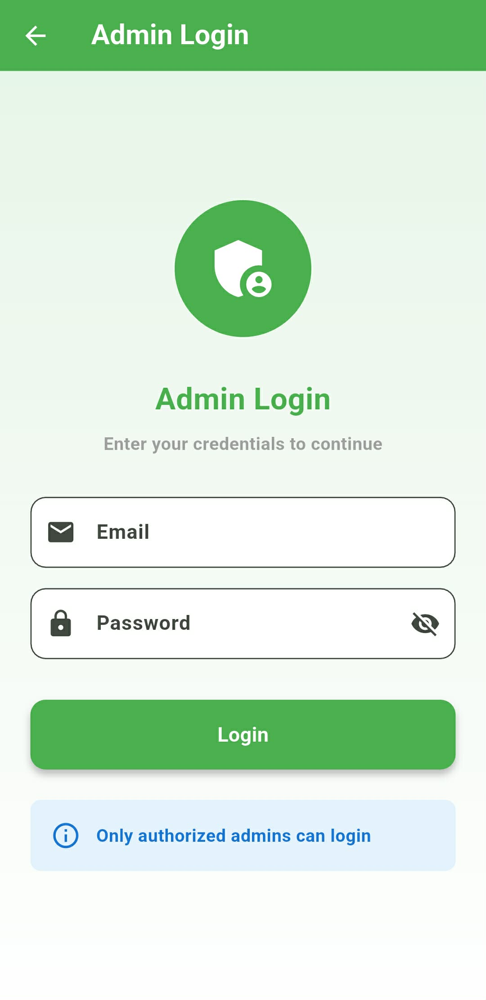
  </a>
</p>

---

## 📊 Admin Dashboard

<p align="center">
  <a href="assets/screenshots/admin_dashboard.png">
    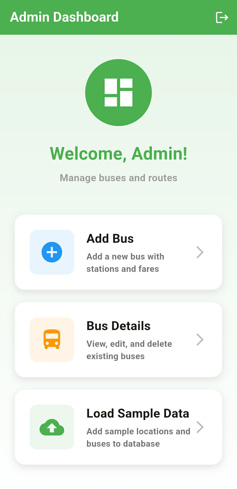
  </a>
</p>

---

## ➕ Add Bus

<p align="center">
  <a href="assets/screenshots/add_bus.png">
    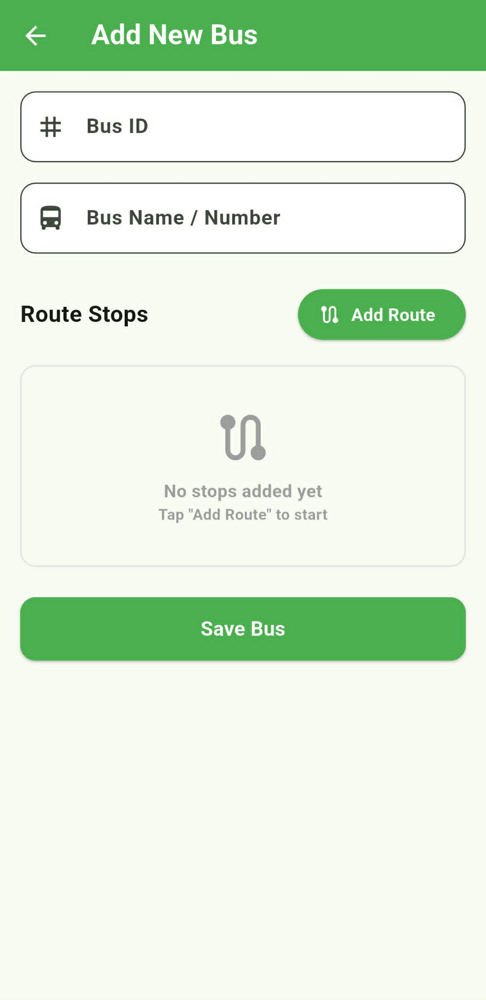
  </a>

  <a href="assets/screenshots/add_route.png">
    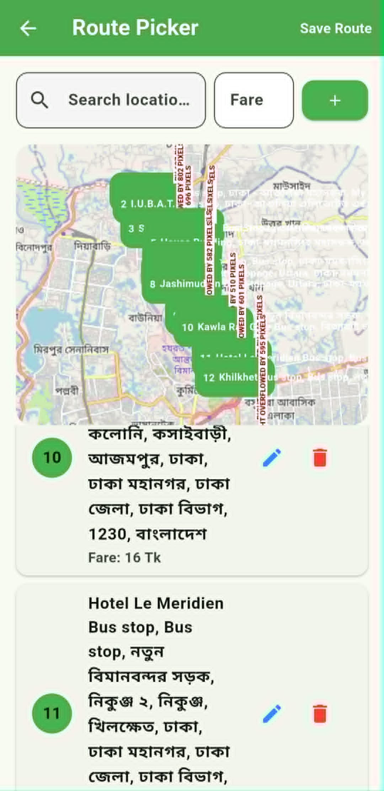
  </a>
</p>

---

## ✏️ Edit Bus

<p align="center">
  <a href="assets/screenshots/edit_bus.png">
    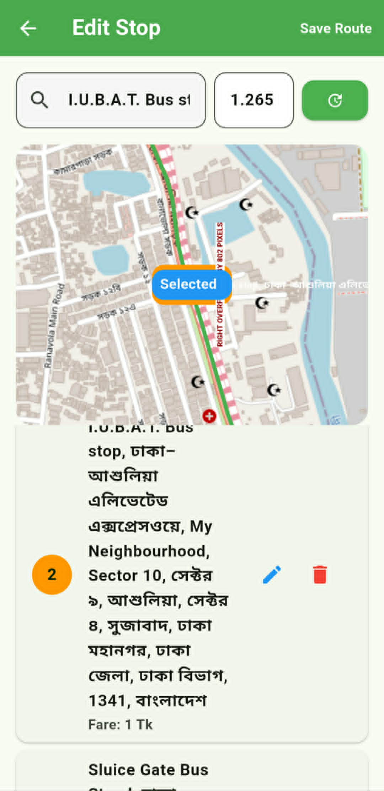
  </a>
</p>---

# 🛠️ Technology Stack

## 📱 Frontend

| Technology | Purpose |
|------------|---------|
| Flutter | Cross-platform mobile application development |
| Dart | Programming language |
| Material Design 3 | Modern UI components |
| Flutter Map | OpenStreetMap integration |
| LatLong2 | Geographic coordinate handling |

---

## ☁️ Backend

| Technology | Purpose |
|------------|---------|
| Firebase Authentication | Admin authentication |
| Cloud Firestore | NoSQL cloud database |
| Firebase Core | Firebase initialization |

---

## 🗺️ Map & Location Services

| Technology | Purpose |
|------------|---------|
| OpenStreetMap | Base map provider |
| Nominatim API | Place search & reverse geocoding |
| OSRM API | Route generation |
| Geolocator | GPS & current location |

---

## 📦 Packages Used

```yaml
firebase_core
firebase_auth
cloud_firestore
flutter_map
latlong2
geolocator
http
package_info_plus
```

---

# 🏗️ System Architecture


---

## 🏛️ Application Architecture


---

# 📂 Folder Structure

```text
BusHub/
│
├── android/
├── ios/
├── assets/
│   ├── images/
│   ├── icons/
│   └── screenshots/
│
├── lib/
│   │
│   ├── main.dart
│   ├── firebase_options.dart
│   │
│   ├── models/
│   │   ├── bus_model.dart
│   │   ├── location_model.dart
│   │   └── route_stop_model.dart
│   │
│   ├── services/
│   │   ├── firestore_service.dart
│   │   ├── osm_route_service.dart
│   │   └── initial_data_service.dart
│   │
│   ├── screens/
│   │   ├── admin_login_screen.dart
│   │   ├── admin_dashboard_screen.dart
│   │   ├── edit_bus_screen.dart
│   │   ├── bus_details_screen.dart
│   │   ├── add_bus_screen.dart
│   │   ├── home_screen.dart
│   │   ├── user_search_screen.dart
│   │   ├── bus_list_screen.dart
│   │   └── map_route_picker.dart
│   │
│   └── widgets/
├──docs
│   ├── 00_project_summary.md
│   ├── chapter_1_introduction.md
│   ├── chapter_2_literature_review.md
│   ├── chapter_3_requirement_analysis.md
│   ├── chapter_4_system_analysis_design.md
│   ├── chapter_5_database_design.md
│   ├── chapter_6_ui_ux_design.md
│   ├── chapter_7_system_implementation.md
│   ├── chapter_8_testing.md
│   ├── chapter_9_security.md
│   ├── chapter_10_results_discussion.md
│   └── chapter_11_conclusion.md
├── SETUP_GUIDE.md 
├── pubspec.yaml 
├── pubspec.lock
├── README.md
├── LICENSE
└── .gitignore
```

---

# 🚀 Installation

## 📋 Prerequisites

Before starting, make sure the following software is installed:

- Flutter SDK (3.0 or later)
- Dart SDK
- Android Studio or VS Code
- Android SDK
- Git
- Firebase CLI *(optional)*

---

## 1️⃣ Clone the Repository

```bash
git clone https://github.com/abidoology/BusHub.git
```

```bash
cd BusHub
```

---

## 2️⃣ Install Dependencies

```bash
flutter pub get
```

---

## 3️⃣ Verify Flutter Installation

```bash
flutter doctor
```

Ensure there are no critical issues before proceeding.

---

## 4️⃣ Generate Platform Files *(if required)*

```bash
flutter create .
```

---

## 5️⃣ Run the Application

```bash
flutter run
```

---

## 📱 Build Release

### Android APK

```bash
flutter build apk --release
```

### Android App Bundle

```bash
flutter build appbundle --release
```

### iOS

```bash
flutter build ios --release
```

### Web

```bash
flutter build web
```

---

## ✅ Installation Complete

If everything is configured correctly, the application will launch successfully and connect to Firebase automatically.

---

# 🔥 Firebase Setup

## Step 1: Create a Firebase Project

1. Visit **Firebase Console**
2. Click **Create a Project**
3. Enter your project name.
4. Continue with the default settings.
5. Wait until the project is created.

---

## Step 2: Register Android App

1. Open your Firebase project.
2. Click **Add App → Android**.
3. Enter your Android package name.

```
com.example.dhaka_bus_route_fare
```

4. Download the **google-services.json** file.
5. Place it inside:

```
android/app/google-services.json
```

---

## Step 3: Register iOS App

1. Click **Add App → iOS**
2. Enter your Bundle ID.
3. Download

```
GoogleService-Info.plist
```

4. Place it inside

```
ios/Runner/
```

---

## Step 4: Enable Authentication

Navigate to

```
Firebase Console
→ Authentication
→ Sign-in Method
```

Enable

- ✅ Email/Password Authentication

Create an admin account.

Example

| Email | Password |
|--------|----------|
| admin@dhaka.com | admin123 |

---

## Step 5: Create Firestore Database

Navigate to

```
Firebase Console
→ Firestore Database
```

Create the database in **Production Mode**.

---

## Step 6: Firestore Security Rules

```javascript
rules_version = '2';

service cloud.firestore {

  match /databases/{database}/documents {

    match /buses/{document} {
      allow read: if true;
      allow write: if request.auth != null;
    }

    match /locations/{document} {
      allow read: if true;
      allow write: if request.auth != null;
    }

  }

}
```

---

## Step 7: FlutterFire Configuration

Install FlutterFire CLI

```bash
dart pub global activate flutterfire_cli
```

Configure Firebase

```bash
flutterfire configure
```

This generates

```
lib/firebase_options.dart
```

---

# ▶️ Running the App

## Get Dependencies

```bash
flutter pub get
```

---

## Check Flutter Environment

```bash
flutter doctor
```

---

## Run Application

```bash
flutter run
```

---

## Run on Specific Device

```bash
flutter devices
```

```bash
flutter run -d <device_id>
```

---

## Build Android APK

```bash
flutter build apk --release
```

---

## Build Android App Bundle

```bash
flutter build appbundle --release
```

---

## Build iOS

```bash
flutter build ios --release
```

---

## Build Web

```bash
flutter build web
```

---

# 🗄️ Database

## Firestore Collections

The application uses two main collections.

### 1. buses

Stores all bus information.

```json
{
  "busId": "DE-001",
  "busName": "Dhaka Express",
  "stations": [
    "Mohakhali",
    "Gulshan",
    "Banani",
    "Uttara"
  ],
  "faresFromSource": {
    "Mohakhali": 0,
    "Gulshan": 20,
    "Banani": 30,
    "Uttara": 50
  },
  "route": [
    {
      "name": "Mohakhali",
      "latitude": 23.7760,
      "longitude": 90.4070,
      "fare": 0
    }
  ]
}
```

---

### 2. locations

Stores unique bus stop names.

```json
{
  "locationId": "1715241837562",
  "locationName": "Mohakhali"
}
```

---

## Database Structure

```
Firestore
│
├── buses
│     ├── documentId
│     │      ├── busId
│     │      ├── busName
│     │      ├── stations
│     │      ├── faresFromSource
│     │      └── route
│
└── locations
      ├── documentId
             ├── locationId
             └── locationName
```

---

# 🌐 API Documentation

## External APIs

### OpenStreetMap

Used for displaying map tiles.

```
https://tile.openstreetmap.org/{z}/{x}/{y}.png
```

---

### Nominatim API

Used for searching locations.

Search

```
https://nominatim.openstreetmap.org/search
```

Reverse Geocoding

```
https://nominatim.openstreetmap.org/reverse
```

---

### OSRM API

Used for route generation.

```
https://router.project-osrm.org/route/v1/driving/
```

---

## Firebase Services

| Service | Purpose |
|----------|---------|
| Firebase Authentication | Admin Login |
| Cloud Firestore | Store Bus Data |

---

## Firestore Service Methods

| Method | Description |
|---------|-------------|
| getLocations() | Retrieve all locations |
| addLocation() | Add a new location |
| busIdExists() | Check duplicate Bus ID |
| getAllBuses() | Retrieve all buses |
| addBus() | Add new bus |
| updateBus() | Update existing bus |
| deleteBus() | Delete a bus |
| searchBuses() | Search buses between two locations |
| calculateFare() | Calculate journey fare |
| getStationsWithFares() | Return fare breakdown |
| getRouteSegment() | Retrieve route segment |

---

## Request Flow
### Search Buses


---
### View Route on Map


---
### Admin Login


---
### Admin CRUD Operations


---

# 📄 License

This project is licensed under the **MIT License**.

```
MIT License

Copyright (c) 2026 BusHub

Permission is hereby granted, free of charge, to any person obtaining a copy
of this software and associated documentation files (the "Software"), to deal
in the Software without restriction, including without limitation the rights
to use, copy, modify, merge, publish, distribute, sublicense, and/or sell
copies of the Software, and to permit persons to whom the Software is
furnished to do so, subject to the following conditions:

The above copyright notice and this permission notice shall be included in all
copies or substantial portions of the Software.

THE SOFTWARE IS PROVIDED "AS IS", WITHOUT WARRANTY OF ANY KIND.
```

---

# 📞 Contact

## 👨‍💻 Project Information

**Project Name**

BusHub – Dhaka Bus Route & Fare Finder

---

**Project Type**

Final Year University Project

---

**Technology Stack**

- Flutter
- Firebase
- Cloud Firestore
- OpenStreetMap
- OSRM API
- Nominatim API

---

## 📧 Contact Information

| Name | Contact |
|------|---------|
| Md. Abid Hossain | habid3328@gmail.com |
| Rabsha Ibnath | --------|

---

## 🐛 Report Issues

If you find a bug or have suggestions, please open an Issue in the GitHub repository.

---

# 🙏 Acknowledgements

Special thanks to the following technologies and communities that made this project possible.

---

## 💙 Flutter

Cross-platform application development framework.

https://flutter.dev

---

## 🔥 Firebase

Authentication and Cloud Firestore backend.

https://firebase.google.com

---

## 🗺️ OpenStreetMap

Open-source map data used throughout the application.

https://www.openstreetmap.org

---

## 🧭 OSRM

Open Source Routing Machine used for route generation.

https://project-osrm.org

---

## 📍 Nominatim

Geocoding and reverse geocoding service.

https://nominatim.org

---

## ❤️ Google Material Design

Modern UI and design guidelines.

https://m3.material.io

---

# ❓ FAQ

## Is the application free?

Yes.

BusHub is completely free to use.

---

## Which platforms are supported?

- Android
- iOS

---

## Does the application require an Internet connection?

Yes.

An Internet connection is required to access Firebase and OpenStreetMap services.

---

## Does the app support offline mode?

Currently, offline mode is not available.

It is planned for future releases.

---

## How are bus fares calculated?

The application stores cumulative fares from the source station and calculates the fare using the difference between source and destination.

A minimum fare rule is also applied.

---

## Can anyone modify bus information?

No.

Only authenticated administrators can add, edit, or delete bus information.

---

## Is GPS required?

GPS is only required for the **My Location** feature.

The application can still search buses without GPS permission.

---

## Which database is used?

Cloud Firestore (Firebase NoSQL Database).

---

## Which map provider is used?

OpenStreetMap.

---

## Is Google Maps used?

No.

The application uses:

- OpenStreetMap
- Nominatim API
- OSRM API

---

# 🗺️ Roadmap

The following roadmap outlines the planned improvements and future development of **BusHub – Dhaka Bus Route & Fare Finder**.

---

## ✅ Version 1.0.0 (Completed)

### Core Features
- ✅ User bus search
- ✅ Route visualization
- ✅ Fare calculation
- ✅ Fare breakdown
- ✅ OpenStreetMap integration
- ✅ GPS current location
- ✅ Firebase Authentication
- ✅ Cloud Firestore integration
- ✅ Admin Dashboard
- ✅ Add/Edit/Delete buses
- ✅ Route Picker
- ✅ Sample data loader
- ✅ Responsive UI
- ✅ Real-time database updates

---

# 📊 Project Status

| Module | Status |
|---------|:------:|
| Flutter UI | ✅ Complete |
| Firebase Integration | ✅ Complete |
| Authentication | ✅ Complete |
| Cloud Firestore | ✅ Complete |
| Bus Search | ✅ Complete |
| Fare Calculation | ✅ Complete |
| Route Visualization | ✅ Complete |
| GPS Location | ✅ Complete |
| Admin Dashboard | ✅ Complete |
| CRUD Operations | ✅ Complete |
| Testing | ✅ Complete |
| Documentation | ✅ Complete |
| Deployment Ready | ✅ Yes |

---

## Overall Progress

| Progress | Completion |
|-----------|------------|
| Planning | ✅ 100% |
| Development | ✅ 100% |
| Testing | ✅ 100% |
| Documentation | ✅ 100% |
| Deployment | ✅ Ready |

---

# 📈 Statistics

## 📊 Project Overview

| Item | Value |
|------|-------|
| Platform | Android & iOS |
| Framework | Flutter |
| Language | Dart |
| Backend | Firebase |
| Database | Cloud Firestore |
| Maps | OpenStreetMap |
| Routing API | OSRM |
| Geocoding API | Nominatim |

---

## 📱 Application Statistics

| Metric | Value |
|--------|-------|
| Total Screens | 8+ |
| Models | 3 |
| Service Classes | 3 |
| Firebase Collections | 2 |
| Firebase Services | 2 |
| External APIs | 3 |
| Dart Files | 15+ |
| Lines of Code | 3,000+ |

---

# Footer

<div align="center">

# 🚌 BusHub

### Dhaka Bus Route & Fare Finder

*A modern Flutter application for smarter public transportation in Dhaka.*

Flutter • Firebase • Cloud Firestore • OpenStreetMap • OSRM • Nominatim

**Final Year University Project**

Department of Computer Science & Engineering

© 2026 BusHub. All Rights Reserved.

</div>
